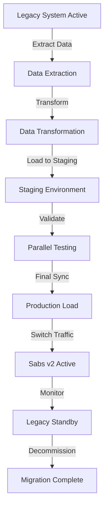

# Sabs v2 Data Migration Strategy

## Overview

This document outlines the comprehensive strategy for migrating data from the legacy Sabs system to the new Sabs v2 platform. The migration is designed to ensure zero-downtime transition, data integrity, and seamless business continuity.

## Migration Architecture

### Phase-Based Approach

**Phase 1: Data Extraction & Analysis** ⏱️ Duration: 1-2 days
- Extract all data from legacy MySQL database
- Analyze data quality and consistency
- Identify data transformation requirements
- Generate extraction reports and manifests

**Phase 2: Data Transformation** ⏱️ Duration: 2-3 days  
- Transform legacy data to Sabs v2 format
- Map legacy IDs to new UUID format
- Cleanse and validate data
- Apply business rule transformations

**Phase 3: Parallel Run Testing** ⏱️ Duration: 1 week
- Load data into staging Sabs v2 environment
- Run parallel operations on both systems
- Validate data consistency and business logic
- Performance testing and optimization

**Phase 4: Production Migration** ⏱️ Duration: 4-6 hours
- Scheduled maintenance window
- Final data sync and cutover
- DNS/traffic routing to new system
- Legacy system decommission

## Zero-Downtime Migration Strategy

### Blue-Green Deployment Approach

1. **Blue Environment**: Current legacy Sabs system
2. **Green Environment**: New Sabs v2 system

### Migration Process



## Data Migration Tools

### 1. Legacy Data Extractor (`legacy-extractor.ts`)

**Purpose**: Extract data from legacy MySQL database
**Features**:
- Batch processing for large datasets
- Data integrity verification with checksums
- Incremental extraction capability
- Connection pooling and error handling

**Usage**:
```bash
# Extract all data
ts-node scripts/data-migration/legacy-extractor.ts extract

# Validate extracted data
ts-node scripts/data-migration/legacy-extractor.ts validate
```

### 2. Data Transformer (`data-transformer.ts`)

**Purpose**: Transform legacy data to Sabs v2 format
**Features**:
- Legacy ID to UUID mapping
- Data validation and cleansing
- Business rule application
- Error tracking and reporting

**Usage**:
```bash
# Transform all extracted data
ts-node scripts/data-migration/data-transformer.ts transform

# Validate transformed data
ts-node scripts/data-migration/data-transformer.ts validate
```

### 3. Data Loader (`data-loader.ts`)

**Purpose**: Load transformed data into Sabs v2 database
**Features**:
- Batch processing with transactions
- Referential integrity validation
- Backup and restore capabilities
- Progress tracking and error handling

**Usage**:
```bash
# Load all transformed data
ts-node scripts/data-migration/data-loader.ts load

# Validate loaded data
ts-node scripts/data-migration/data-loader.ts validate

# Create backup
ts-node scripts/data-migration/data-loader.ts backup
```

### 4. Migration Runner (`migration-runner.ts`)

**Purpose**: Manage database schema migrations
**Features**:
- Sequential migration execution
- Checksum-based integrity verification
- Rollback capability
- Migration history tracking

## Data Mapping & Transformation

### Entity Mappings

#### Companies
```sql
-- Legacy -> Sabs v2
SELECT 
  uuid_generate_v4() as id,                    -- New UUID
  company_name as name,                        -- Direct mapping  
  email,                                       -- Direct mapping
  phone,                                       -- Direct mapping
  address,                                     -- Direct mapping
  'GH' as country_code,                        -- Default to Ghana
  'GHS' as currency,                           -- Default currency
  'Africa/Accra' as timezone,                  -- Default timezone
  CASE status 
    WHEN 1 THEN 'active'
    WHEN 0 THEN 'inactive' 
    ELSE 'trial'
  END as status,                               -- Status mapping
  '{}' as settings,                            -- Empty settings
  'basic' as subscription_plan,                -- Default plan
  1000 as sms_credits,                         -- Default credits
  500 as ai_credits,                           -- Default credits
  '{"deposit": 0.02, "withdrawal": 0.03}' as commission_rates,
  created_at,
  created_at as updated_at
FROM legacy.companies
```

#### Users
```sql
-- Legacy -> Sabs v2  
SELECT
  uuid_generate_v4() as id,                    -- New UUID
  company_uuid as company_id,                  -- Mapped company UUID
  email,                                       -- Direct mapping
  bcrypt_hash(password) as password_hash,      -- Re-hash passwords
  split_part(name, ' ', 1) as first_name,     -- Extract first name
  trim(substring(name from position(' ' in name)+1)) as last_name,
  phone,                                       -- Direct mapping
  CASE role
    WHEN 'admin' THEN 'company_admin'
    WHEN 'clerk' THEN 'clerk'
    WHEN 'teller' THEN 'clerk'
    WHEN 'agent' THEN 'field_agent'
    ELSE 'field_agent'
  END as role,                                 -- Role mapping
  CASE status
    WHEN 1 THEN 'active'
    WHEN 0 THEN 'inactive'
    ELSE 'pending'
  END as status,                               -- Status mapping
  agent_code,                                  -- Direct mapping
  0 as login_attempts,                         -- Reset attempts
  created_at,
  created_at as updated_at
FROM legacy.users
```

#### Customers
```sql
-- Legacy -> Sabs v2
SELECT
  uuid_generate_v4() as id,                    -- New UUID
  company_uuid as company_id,                  -- Mapped company UUID
  customer_number,                             -- Direct mapping
  first_name,                                  -- Direct mapping
  last_name,                                   -- Direct mapping
  phone,                                       -- Direct mapping
  email,                                       -- Direct mapping
  'pending' as kyc_status,                     -- Default KYC status
  '[]' as kyc_documents,                       -- Empty documents
  balance,                                     -- Direct mapping
  CASE status
    WHEN 1 THEN 'active'
    ELSE 'inactive'
  END as account_status,                       -- Status mapping
  agent_uuid as created_by_agent_id,           -- Mapped agent UUID
  created_at,
  created_at as updated_at
FROM legacy.customers
```

#### Transactions
```sql
-- Legacy -> Sabs v2
SELECT
  uuid_generate_v4() as id,                    -- New UUID
  company_uuid as company_id,                  -- Mapped company UUID
  reference,                                   -- Direct mapping
  customer_uuid as customer_id,                -- Mapped customer UUID
  agent_uuid as agent_id,                      -- Mapped agent UUID
  CASE transaction_type
    WHEN 'credit' THEN 'deposit'
    WHEN 'debit' THEN 'withdrawal'
    ELSE transaction_type
  END as type,                                 -- Type mapping
  amount,                                      -- Direct mapping
  fee,                                         -- Direct mapping
  commission,                                  -- Direct mapping
  CASE status
    WHEN 'successful' THEN 'completed'
    WHEN 'processing' THEN 'pending'
    ELSE status
  END as status,                               -- Status mapping
  description,                                 -- Direct mapping
  balance_before,                              -- Direct mapping
  balance_after,                               -- Direct mapping
  created_at,
  created_at as updated_at
FROM legacy.transactions
```

## Data Validation Rules

### Pre-Migration Validation

1. **Data Completeness**
   - All required fields populated
   - No orphaned records
   - Referential integrity maintained

2. **Data Quality**
   - Valid email formats
   - Phone number formats
   - Positive balances
   - Valid date ranges

3. **Business Rules**
   - Transaction amounts match balance changes
   - Commission calculations are correct
   - Customer numbers are unique per company

### Post-Migration Validation

1. **Record Counts**
   - Verify all records migrated successfully
   - Compare totals between systems

2. **Data Integrity**
   - Foreign key constraints satisfied
   - No data corruption during transformation

3. **Business Logic**
   - Balance calculations match
   - Commission calculations are correct
   - Transaction histories are complete

## Rollback Strategy

### Automated Rollback Triggers

1. **Data Validation Failures**
   - More than 5% of records fail validation
   - Critical business rules violated
   - Referential integrity errors

2. **Performance Issues**
   - Response times > 2x baseline
   - Database connection failures
   - Memory/CPU utilization > 90%

3. **Business Impact**
   - User login failures > 10%
   - Transaction processing errors > 1%
   - Critical feature unavailability

### Rollback Process

1. **Immediate Actions** (< 5 minutes)
   - Switch traffic back to legacy system
   - Notify stakeholders
   - Activate incident response

2. **Data Recovery** (< 30 minutes)
   - Restore from pre-migration backup
   - Verify data consistency
   - Re-enable legacy system features

3. **Investigation** (< 2 hours)
   - Analyze failure cause
   - Document issues
   - Plan remediation

## Risk Mitigation

### Technical Risks

| Risk | Impact | Probability | Mitigation |
|------|--------|-------------|------------|
| Data corruption during migration | High | Low | Comprehensive backups, validation checks |
| Performance degradation | Medium | Medium | Load testing, query optimization |
| Extended downtime | High | Low | Rehearsal runs, automated rollback |
| Data inconsistency | High | Low | Parallel validation, checksums |

### Business Risks

| Risk | Impact | Probability | Mitigation |
|------|--------|-------------|------------|
| User access disruption | High | Low | Communication plan, training |
| Transaction processing errors | High | Low | Thorough testing, monitoring |
| Compliance violations | Medium | Low | Audit trail preservation |
| Customer data loss | High | Very Low | Multiple backup strategies |

## Migration Timeline

### Pre-Migration (1 week)

**Day -7 to -5: Preparation**
- Finalize migration scripts
- Set up staging environments
- Coordinate with stakeholders

**Day -4 to -2: Testing**
- Run full migration rehearsal
- Performance testing
- User acceptance testing

**Day -1: Final Preparation**
- Final data extraction
- Go/no-go decision
- Team briefing

### Migration Day

**Hour -2 to 0: Pre-migration**
- Final system backups
- User notifications
- Enable maintenance mode

**Hour 0 to 4: Migration**
- Execute data migration
- Validate data integrity
- Performance verification

**Hour 4 to 6: Validation**
- End-to-end testing
- User acceptance validation
- Traffic switch to Sabs v2

### Post-Migration (1 week)

**Day +1 to +3: Monitoring**
- 24/7 system monitoring
- Performance optimization
- Issue resolution

**Day +4 to +7: Stabilization**
- Final validations
- Legacy system decommission
- Documentation updates

## Monitoring & Alerting

### Key Metrics

1. **Migration Progress**
   - Records extracted: Target 100%
   - Records transformed: Target 100%
   - Records loaded: Target 100%
   - Validation errors: Target < 0.1%

2. **System Performance**
   - Response time: Target < 500ms
   - CPU utilization: Target < 70%
   - Memory usage: Target < 80%
   - Database connections: Target < 80%

3. **Business Metrics**
   - User logins: Monitor 100% success
   - Transaction processing: Monitor 100% success
   - API responses: Monitor < 1% errors

### Alert Conditions

- **Critical**: Migration failure, system down, data corruption
- **Warning**: Performance degradation, validation errors > 1%
- **Info**: Migration progress updates, milestone completion

## Communication Plan

### Stakeholder Notifications

1. **Pre-Migration**
   - 1 week notice: All users
   - 24 hours notice: Admin users
   - 2 hours notice: Technical team

2. **During Migration**
   - Real-time updates: Technical team
   - Hourly updates: Management
   - Status page: All users

3. **Post-Migration**
   - Success notification: All stakeholders
   - Performance reports: Management
   - User guides: End users

## Success Criteria

### Technical Success

- ✅ 100% data extraction from legacy system
- ✅ > 99.9% successful data transformation  
- ✅ > 99.9% successful data loading
- ✅ All validation checks pass
- ✅ Performance meets or exceeds SLA
- ✅ Zero data loss or corruption

### Business Success

- ✅ < 4 hours total downtime
- ✅ All users can access new system
- ✅ All transactions process correctly
- ✅ No impact on customer operations
- ✅ Audit trail preserved
- ✅ Compliance requirements met

## Conclusion

This migration strategy provides a comprehensive, risk-mitigated approach to transitioning from legacy Sabs to Sabs v2. The phased approach, automated tooling, and robust validation ensure successful migration with minimal business disruption.

The combination of thorough testing, automated rollback capabilities, and comprehensive monitoring provides confidence in the migration process while maintaining the ability to quickly recover from any issues.

---

**Migration Team**
- **Migration Lead**: [Name]
- **Database Engineer**: [Name]  
- **DevOps Engineer**: [Name]
- **Quality Assurance**: [Name]
- **Business Stakeholder**: [Name]

**Next Steps**
1. Review and approve migration strategy
2. Set up staging environments
3. Begin migration rehearsals
4. Schedule production migration window